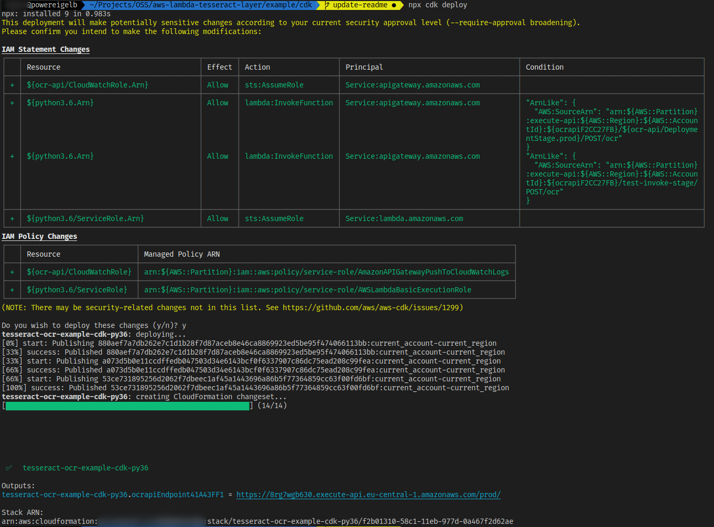

Example: AWS Lambda with Tesseract layer (Amazon Linux 2 based runtime - Python 3.8)
===

### Requirements

- Docker
- Node.Js

### Deploy Stack

```bash
## install dependencies
yarn install
## deploy
npx cdk deploy
```



### Invoke your API with an URL to an Image

```bash
curl -X POST \
  https://16ary8rftd.execute-api.eu-central-1.amazonaws.com/prod/ocr \
  -d https://upload.wikimedia.org/wikipedia/de/e/eb/Goethe_Faust_Textbeispiel_Grossschreibung.png
```

### Remove Stack

```
npx cdk destroy
```